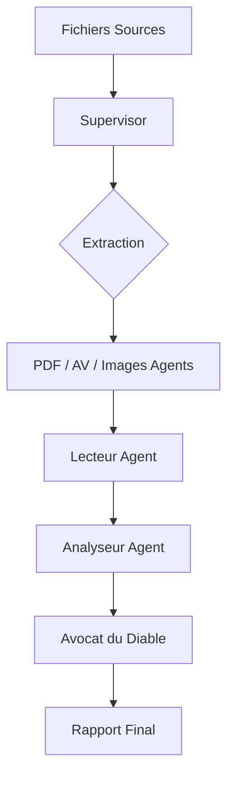

# AnalyseMedia 🧠

Système multi-agents intelligent dédié à l'analyse approfondie de contenus multimédias (PDF, Audio, Vidéo, Images).

## 🚀 Vision du Projet

`AnalyseMedia` est conçu comme un pipeline d'analyse modulaire où chaque étape est gérée par un agent spécialisé. L'objectif est de transformer des fichiers bruts en rapports d'analyse structurés, exploitables pour la création de contenu, la formation ou l'aide à la décision.

## 🤖 l'Équipe d'Agents (System Architecture)

Le projet repose sur une orchestration granulaire définie dans `.agent/rules/` :

1. **Supervisor** (`supervisor.md`) : Le chef d'orchestre. Il trie les fichiers, délègue les tâches et assemble la synthèse finale.
2. **PDFAgent** (`pdf_agent.md`) : Expert en extraction de texte et de structure depuis des documents PDF.
3. **AudioVideoAgent** (`audio_video_agent.md`) : Responsable de la transcription (STT) et du chapitrage temporel.
4. **ImagesAgent** (`images_agent.md`) : Spécialiste de l'OCR visuel et de l'interprétation de schémas.
5. **LecteurAgent** (`lecteur_agent.md`) : Assure la compréhension profonde, l'extraction de concepts et la classification thématique.
6. **AnalyseurAgent** (`analyseur_agent.md`) : Synthétise les données, identifie les corrélations, extrait les exercices et leurs bénéfices/peines.
7. **AvocatDuDiable** (`avocat_diable_agent.md`) : Défie les conclusions pour garantir un rapport sans biais et d'une rigueur absolue.

## 🛠️ Workflow

## 📁 Structure du Workspace

- `.agent/rules/` : Définitions des rôles et compétences des agents.
- `input/` : (À créer) Contient les médias à analyser.
- `output/` : (À créer) Contient les rapports et artefacts produits.

## 📝 Usage

Pour lancer une analyse, déposez vos fichiers dans `input/` et demandez au **Supervisor** de démarrer le pipeline.
