# Architecture Stratégique PEPPS et Audit

Ce document présente la restructuration complète de la formation selon la méthode **P.E.P.P.S.**, en réponse à l'audit du livret "Prendre la parole avec PEPPS".

## 1. Audit de Redondance & Rationalisation

L'analyse croisée révèle que la méthode PEPPS englobe et structure la quasi-totalité des contenus épars des anciennes "Magic Boxes".

| Ancien Contenu (Magic Box / Livret) | Statut | Nouveau Module Cible (PEPPS) | Action Requise |
| :--- | :--- | :--- | :--- |
| **MB 1 : Le Trésor de la Motivation** | 🚨 Doublon | **S** - Stimulation (Le Pourquoi) | **Supprimer** le livret MB1. Intégrer l'exercice "5 Pourquoi" dans le module Stimulation. |
| **MB 2 : Enlève ton Armure (Peurs)** | 🚨 Doublon | **P** - Paix Intérieure | **Supprimer** le livret MB2. Intégrer la gestion des peurs dans Paix Intérieure. |
| **MB 3 : Confiance & Préparation** | 🚨 Doublon | **P** - Préparation (Structure) & **P** - Présence | **Supprimer** le livret MB3. Répartir entre Préparation (Technique) et Présence (Ancrage). |
| **MB 4 : Affirmation de Soi** | ⚠️ Partiel | **E** - Expression & **P** - Paix Intérieure | Garder les concepts clés pour le module Expression (Verbal). Supprimer le reste. |
| **MB 5 : Rayonner / Briller** | 🚨 Doublon | **P** - Présence & **E** - Expression | **Supprimer**. "Rayonner" est l'objectif transversal de PEPPS. |
| **Livret : Forces de Caractère (VIA)** | ♻️ À Intégrer | **S** - Stimulation (Singularité) | Garder le Test VIA comme outil puissant pour la "Singularité". |
| **Livret : Révèle tes Talents** | ♻️ À Intégrer | **S** - Stimulation | À fusionner avec les "Singularités". |

> **Décision Architecturale** : Abandonner définitivement la numérotation "Magic Box". Adopter la structure unique P.E.P.P.S. qui sert de colonne vertébrale à toute la formation.

---

## 2. Livrable 1 : Mind Map de Structure PEPPS

```mermaid
graph TD
    Root[MÉTHODE P.E.P.P.S.] --> P1[P - PRÉSENCE Puissante]
    Root --> E2[E - EXPRESSION Authentique]
    Root --> P3[P - PRÉPARATION Libératrice]
    Root --> P4[P - PAIX Intérieure]
    Root --> S5[S - STIMULATION Contagieuse]

    %% Branche Présence
    P1 --> P1_1(Ancrage & Corps)
    P1 --> P1_2(Connexion Visuelle)
    P1 --> P1_3(Le Sourire comme arme)

    %% Branche Expression
    E2 --> E2_1(Le Verbal : Les Mots)
    E2 --> E2_2(Le Vocal : La Musique)
    E2 --> E2_3(Le Visuel : Le Corps qui parle)
    E2 --> E2_4(Congruence & Authenticité)

    %% Branche Préparation
    P3 --> P3_1(Structure du discours)
    P3 --> P3_2(Rituel d'échauffement)
    P3 --> P3_3(Répétition intelligente)

    %% Branche Paix Intérieure
    P4 --> P4_1(Gestion du Trac)
    P4 --> P4_2(Dialogue Intérieur 'Gigi')
    P4 --> P4_3(Accueil Émotionnel)

    %% Branche Stimulation
    S5 --> S5_1(Le Pourquoi - Moteur)
    S5 --> S5_2(Singularité & Leadership)
    S5 --> S5_3(Amplification d'Énergie)
```

---

## 3. Livrable 2 : Matrice des Exercices

Ce tableau croise chaque exercice unique avec son emplacement définitif.

| Nom de l'Exercice | Module PEPPS | Objectif Pédagogique | Statut |
| :--- | :--- | :--- | :--- |
| **Scan Corporel Express** | **P**résence | Revenir à soi, ancrage immédiat. | ✅ Validé PEPPS |
| **La Danse du Regard** | **P**résence | Connecter avec le public sans fixer. | ✅ Validé PEPPS |
| **Ma Voix en Technicolor** | **E**xpression | Connecter son message à ses valeurs profondes. | ✅ Validé PEPPS |
| **Nuancier des Émotions** | **E**xpression | Tester l'impact de différentes intentions sur une même phrase. | ✅ Validé PEPPS |
| **Du Trac à l'Impact** | **E**xpression | Passer physiquement de la fermeture à l'ouverture. | ✅ Validé PEPPS |
| **Le Nuancier Vocal** | **E**xpression | Varier les intonations (ordre, secret, doute...). | ✅ Validé PEPPS |
| **Échauffement Vocal PEPPS** | **P**réparation | Préparer l'instrument (lèvres, langue, souffle). | ✅ Validé PEPPS |
| **Le Samouraï** | **P**aix Intérieure | Libération émotionnelle intense (cri/geste). | ✅ Validé PEPPS |
| **Enquête Intérieure** | **P**aix Intérieure | Lier valeurs/peurs/fiertés à la prise de parole. | ✅ Validé PEPPS |
| **L'Amplificateur d'Énergie** | **S**timulation | Activer son énergie physique avant de parler. | ✅ Validé PEPPS |
| **Carte des Singularités** | **S**timulation | Identifier ce qui rend l'orateur unique. | ✅ Validé PEPPS |
| **Journal des Moments Uniques** | **S**timulation | Repérer sa singularité au quotidien. | ✅ Validé PEPPS |
| *Les 5 Pourquoi* | **S**timulation | (Issu de MB1) Trouver la racine de la motivation. | ➕ À Ajouter |
| *Test VIA (Forces)* | **S**timulation | (Issu de "Forces") Identifier ses atouts naturels. | ➕ À Ajouter |
| *Vision Board* | **S**timulation | (Issu de "Talents") Visualiser son succès. | ➕ À Ajouter |

## Conclusion
La structure est désormais limpide. **Aucun livret final n'est généré** conformément à la demande. Ce document sert de plan directeur pour la création des slides et supports de formation.
